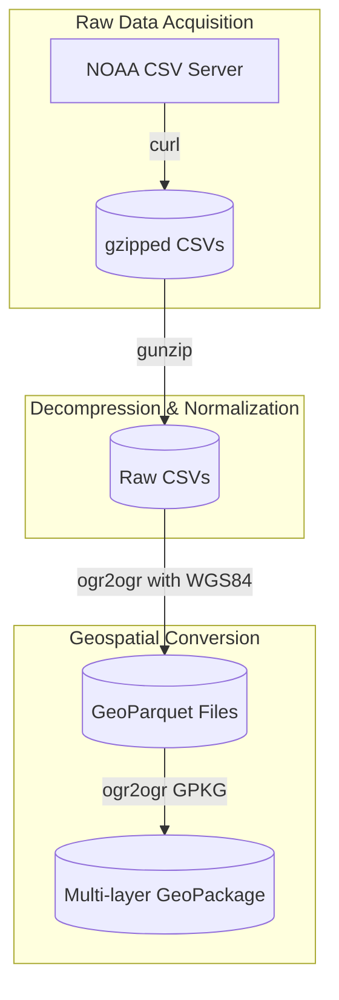

# NOAA Storm Data Processing Pipeline

This documentation details the architecture, execution, and troubleshooting steps for the NOAA Storm Events data pipeline.

## Architectural Overview

The `process_storm_data.sh` script coordinates the flow of downloading raw, historical storm event data and converting it into modern spatial database formats.



---

## Detailed Pipeline Stages

### 1. Download Stage
* **Source**: `https://www.ncei.noaa.gov/pub/data/swdi/stormevents/csvfiles`
* **Target Files**: `StormEvents_details-ftp_v1.0_dYEAR_cDATE.csv.gz` (for years 2022, 2023, 2024).
* **Guards**: The script inspects the downloaded file size. If a download fails (resulting in a small HTTP error page under 10 KB), it aborts early to prevent corrupt files from blocking down-stream processing.

### 2. Decompression Stage
* Files are unpacked using `gunzip -k` (keeping the original compressed archives).
* The unpacked CSV files are renamed to a simplified, standardized format: `StormEvents_details_dYEAR.csv`.

### 3. Spatial GeoParquet Conversion
Using GDAL's `ogr2ogr`, the pipeline reads coordinates directly from the CSV columns:
* **Longitude Column**: `BEGIN_LON`
* **Latitude Column**: `BEGIN_LAT`
* **Coordinate System**: Assigned EPSG:4326 (WGS 84).
* **Command Pattern**:
  ```bash
  ogr2ogr \
      -f "Parquet" \
      "data/storm_events_YEAR.parquet" \
      "data/StormEvents_details_dYEAR.csv" \
      -oo AUTODETECT_TYPE=YES \
      -oo X_POSSIBLE_NAMES=BEGIN_LON \
      -oo Y_POSSIBLE_NAMES=BEGIN_LAT \
      -a_srs EPSG:4326
  ```

### 4. GeoPackage Construction
To simplify visualization in tools like QGIS, a multi-layer SQLite GeoPackage (`storm_events_2022_2024.gpkg`) is built:
* Each year’s Parquet is appended as an independent layer (`storm_events_YEAR`).
* This enables quick visual comparison and toggle features in desktop GIS programs.

---

## Prerequisites

Ensure the following are installed:
* **GDAL/OGR** CLI tools (`ogrinfo`, `ogr2ogr`) compiled with Parquet support.
* **curl**
* **gunzip**

---

## Troubleshooting & Maintenance

### Changing File Dates (404 Errors)
NOAA periodically regenerates these files, updating the creation date (`_cDATE`). If downloads fail:
1. Visit the [NOAA FTP Directory](https://www.ncei.noaa.gov/pub/data/swdi/stormevents/csvfiles/).
2. Locate the current `_cDATE` suffixes for the target years.
3. Update the `CREATION_DATES` associative array inside `process_storm_data.sh`:
   ```bash
   declare -A CREATION_DATES=(
       [2022]="YYYYMMDD"
       [2023]="YYYYMMDD"
       [2024]="YYYYMMDD"
   )
   ```

### Corrupted Downloads (Unexpected End of File)
If you get a decompression error indicating an unexpected end of file, a previous download was likely interrupted. To resolve:
1. Clear the cached files:
   ```bash
   rm -rf ./data
   ```
2. Re-run the script.
